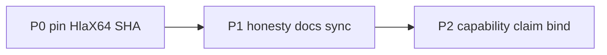

# Stack integrity (P0–P2)

Setelah N0–N4 hijau, fokus = **pin hygiene + klaim jujur**, bukan fitur baru.

**Di luar tranche:** formal `ensures`, Ed25519, CryptOpt, streaming runner PR-009b, A64/RV leaf port, `v0.1.0`.

## P0 — Pin HlaX64 SHA (VAA, S)

Pin `hlax64-bridge` ke SHA tip yang cocok dengan fixture; catat di `docs/progress.md`. Bump pin SemASM ke tip terkini (`1d475a5`) agar pin = `origin/main` SemASM.

## P1 — Honesty docs sync (VAA + SemASM, S)

N0–N4 closed; next = P0–P2. Bersihkan stale ROADMAP / implementation-baseline.

## P2 — Capability claim bind (VAA, S)

Emit `source: "vaa_embedded_agent_verify_snapshot"` pada `vaa capabilities`; jangan mengklaim live SemASM maturity.

## Acceptance

Push kedua repo; CI SemASM + VAA (`check`, Gate-1/2, `hlax64-bridge`) hijau.
