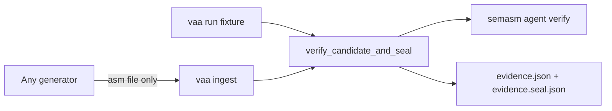

# VAA R2 — Seal + Generator-Agnostic Ingest

## Positioning (dikunci)

| Ide | Terjemahan VAA |
|---|---|
| CryptOpt | Setiap candidate asm **wajib** kembali ke SemASM verify; tidak ada “accepted by generator” |
| Proof Loop | Acceptance (task/contract digests) + evidence **sealed**; agent/generator tidak menulis `final_status` |
| Generator-agnostic | Fixture, LLM, manusia, CryptOpt-like search = **hanya** penyetor source via ingest |

Bukan R2: live provider, harden container, streaming ProcessRunner, golden `sum_i64` SemASM.

## Keputusan desain

### Seal

- Artefak di `RunDir/evidence/`:
  - [`evidence.json`](D:/_2025/Gits/megaalive/vaa/src/run/controller.rs) — laporan penuh (termasuk `timestamp`)
  - `evidence.seal.json` — envelope seal + digests
- **Canonical seal payload** (deterministic, **tanpa** `timestamp` / field volatile):

```text
schema_version: "0.1"
task_id, task_digest, target, run_id
contract_digest, source_digest
semasm_report_digest   // sha256 of verify raw_json (or "none")
final_status, checks (sorted by check_name)
generator: { kind, name, generation_id? }  // attribution claim, untrusted
```

- Hash: `seal_digest = sha256:` + hex atas **canonical JSON** (keys sorted, compact) — pola sama dengan task digest di [`src/task/digest.rs`](D:/_2025/Gits/megaalive/vaa/src/task/digest.rs).
- `vaa evidence check-seal <evidence.json> <evidence.seal.json>` → exit non-zero jika drift.
- Invariant: mengubah task/tests, menukar candidate, atau menempel SemASM report lain **memecah** seal.

### Ingest (generator-agnostic)

CLI baru:

```text
vaa ingest <task.vaa.toml> \
  --contract <contract.sem.toml> \
  --source <candidate.asm> \
  [--generator <name>] \
  [--run-dir <base>] \
  [--format json|terminal]
```

Perilaku:

1. Lock task (immutable).
2. Buat/lanjutkan `RunDir`.
3. `CandidateProtocol.submit(source, path, target)` — dedup/budget/target match.
4. `SemasmVerify` (ProcessRunner, stdout-only, schema 0.4).
5. `EvidenceAggregator::build` + identity expect (sudah ada di R1).
6. Tulis candidate + **seal**; generator **tidak** boleh set `final_status`.

`vaa run` (fixture) memanggil **fungsi library yang sama** (`verify_candidate_and_seal`), hanya beda sumber source (queue vs file).



## Gelombang kerja

### S1 — Seal module

File baru [`src/evidence/seal.rs`](D:/_2025/Gits/megaalive/vaa/src/evidence/seal.rs):

- `SealedEvidenceV01` struct + `seal_digest_of(...)`
- `write_sealed_evidence(dir, report, expect, generator_meta) -> SealEnvelope`
- `verify_seal(report_path, seal_path) -> Result<()>`
- Unit tests: stable digest; mutasi `final_status` / `source_digest` gagal check-seal.

Export dari [`src/evidence/mod.rs`](D:/_2025/Gits/megaalive/vaa/src/evidence/mod.rs). Perkaya [`EvidenceReport`](D:/_2025/Gits/megaalive/vaa/src/evidence/report.rs) field opsional `generator` (attribution only) bila belum ada — atau simpan generator hanya di seal envelope (lebih bersih: **hanya di seal**, report tetap seperti sekarang).

**Default dikunci:** generator metadata **hanya di seal envelope**, bukan di `EvidenceReport`, supaya generator tidak tampak sebagai bagian acceptance.

### S2 — Shared verify+seal path

Modul [`src/run/verify_seal.rs`](D:/_2025/Gits/megaalive/vaa/src/run/verify_seal.rs) (atau perluas controller):

```text
verify_candidate_and_seal(
  locked, contract_path, source_path, source_bytes,
  run_dir, generator_meta, doctor, capability_match
) -> EvidenceReport + SealEnvelope
```

Refactor [`run_fixture_loop`](D:/_2025/Gits/megaalive/vaa/src/run/controller.rs) agar setiap candidate sukses verify memakai path ini (bukan `serde_json` ad-hoc ke `evidence.json` saja).

### S3 — CLI `ingest` + `evidence check-seal`

Di [`src/main.rs`](D:/_2025/Gits/megaalive/vaa/src/main.rs):

- `Commands::Ingest { task, contract, source, generator, run_dir, format }`
- `Commands::Evidence { CheckSeal { evidence, seal } }` (subcommand pendek)

Clap tests + satu ignored live smoke opsional (reuse count_byte repaired asm).

### S4 — Fixtures + docs honesty

- `fixtures/ingest/count_byte/` — README: contoh ingest dari file “asing” (copy repaired asm) tanpa model.
- Update [`docs/progress.md`](D:/_2025/Gits/megaalive/vaa/docs/progress.md) / README: R2 seal+ingest; tekan “generator cannot move acceptance”.
- Catat follow-up: multi-candidate seal history, EventLog bind ke seal, CI live SemASM.

## Kriteria selesai

1. Setiap `vaa run` / `vaa ingest` yang menghasilkan evidence menulis pasangan `evidence.json` + `evidence.seal.json`.
2. `vaa evidence check-seal` gagal jika task/source/contract/status digeser.
3. `vaa ingest` tidak memanggil model adapter; hanya file + SemASM.
4. Unit tests seal + clap; clippy/fmt hijau.
5. Docs menyebut CryptOpt/Proof-Loop positioning tanpa overclaim.
6. Commit VAA (+ push jika diminta).

## Di luar scope

Streaming output / process-group kill, ContainerBackend harden, live LLM, CryptOpt randomized search engine, formal proofs.
