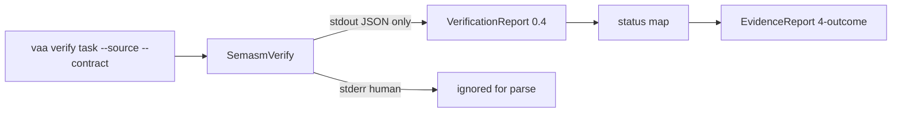

# VAA Adapter Slice (dari WS SemASM)

## Cara eksekusi dari workspace ini

Repo VAA adalah sibling, bukan member Cargo SemASM: [`D:\_2025\Gits\megaalive\vaa`](D:/_2025/Gits/megaalive/vaa).

Saat user menyetujui dan meminta implementasi:

1. Panggil MCP `move_agent_to_root` → `D:\_2025\Gits\megaalive\vaa`.
2. Kerjakan semua edit/commit di root VAA.
3. Rujuk sibling SemASM hanya sebagai sumber kebenaran protokol + golden:
   - [`docs/CONTROLLER_PROTOCOL.md`](D:/_2025/Gits/megaalive/semasm/docs/CONTROLLER_PROTOCOL.md)
   - [`crates/semasm-agent/fixtures/verification-report-count_byte.execution_denied.json`](D:/_2025/Gits/megaalive/semasm/crates/semasm-agent/fixtures/verification-report-count_byte.execution_denied.json)

Tidak mengubah SemASM di slice ini kecuali catatan silang singkat di progress VAA.

## Keputusan dikunci

- **Scope:** adapter verify + CLI contract wiring + fixture smoke (unit + ignored e2e). **Bukan** generate/repair LLM, rewrite orchestrator, atau capabilities live dari SemASM.
- **Parse:** stdout saja; jangan concat stderr.
- **Status map** (dari CONTROLLER_PROTOCOL):

| SemASM `status` | VAA `EvidenceStatus` |
|---|---|
| `verified` | `Verified` |
| `semantic_failed` / `executable_failed` / `behavior_failed` | `Violated` |
| `execution_denied` | `Incomplete` |
| no JSON / parse fail / binary missing / spawn fail | `Failed` |

- **Contract path:** hari ini [`verify_command`](D:/_2025/Gits/megaalive/vaa/src/main.rs) memanggil `SemasmVerify::run(source, task_path, …)` — task `*.vaa.toml` **bukan** kontrak SemASM. Tambah flag wajib untuk jalur SemASM: `--contract <path.sem.toml>`, teruskan `--target` dari task yang di-lock. Tanpa `--allow-execution` (smoke default = `execution_denied` / Incomplete bila static OK).
- **Host smoke default di mesin Windows ini:** task + source Win64 (`x86_64-pc-windows-msvc` + `count_byte_win64.asm`) agar toolchain lokal realistis; unit test tetap memakai golden SysV JSON dari SemASM.

## Gelombang kerja

### V1 — Parse + map di [`src/semasm/verify.rs`](D:/_2025/Gits/megaalive/vaa/src/semasm/verify.rs)

Ganti `VerifyReportRaw` agar cocok report nyata (tanpa `diagnostics` wajib):

- Wajib longgar: `status: String`; tangkap `schema_version`, `tool_version`, `contract_digest`, `source_digest`, `target` bila ada.
- `diagnostics` default `[]` (opsional: ringkas dari `semantic.*.failed` nanti — bukan blocking).
- `serde` toleran field asing (`semantic`, `behavior`, `behavior_oracle`, …).
- `run(...)`: parse **hanya** `stdout`; simpan `stderr` di error detail jika parse gagal / stdout kosong.
- Perluas signature: `run(source, contract, binary, target: &str)` → argv  
  `semasm agent verify <src> <contract> --format json --target <target>`.
- `map_status` sesuai tabel di atas; status asing → `Failed` (bukan Incomplete).
- Soft-check: jika `schema_version` ada dan major ≠ `0`, treat sebagai parse/policy fail → Failed.

Update unit tests: buang JSON fiktif `diagnostics`+`violated`; vendor/copy golden `execution_denied` + stub minimal untuk empat status lain; assert stderr noise tidak merusak `parse_report`.

### V2 — CLI + error class di [`src/main.rs`](D:/_2025/Gits/megaalive/vaa/src/main.rs)

- Tambah `--contract <PathBuf>` pada subcommand `verify`.
- Pass `locked.task().target` ke adapter.
- Pada `VerifyError::*`: set `final_status = Failed` (hari ini Incomplete di jalur error ~L372).
- Update clap unit test parse.

### V3 — Fixtures smoke

Di VAA, tambah misalnya:

- `fixtures/semasm/count_byte/count_byte.vaa.toml` (target Win64, entry `count_byte`)
- Copy/vendor `count_byte_win64.asm` + `count_byte.sem.toml` dari SemASM (atau symlink dokumentasi path absolut relatif sibling — **prefer copy** agar VAA mandiri)
- `fixtures/semasm/reports/verification-report-count_byte.execution_denied.json` (copy golden SemASM)

Ignored e2e (atau script singkat di docs):  
`vaa verify fixtures/semasm/count_byte/count_byte.vaa.toml --source …win64.asm --contract …sem.toml --format json`  
dengan `semasm` di PATH → expect outcome Incomplete + digests/tool_version terisi.

### V4 — Docs VAA

Update singkat `README.md` / `docs/progress.md` / baseline: adapter mengonsumsi SemASM report **0.4**, stdout-only, tabel map, `--contract` wajib untuk verify SemASM. Catat follow-up di luar slice: terjemahan penuh `.vaa.toml`→`.sem.toml`, `--allow-execution` policy, model adapter.

## Kriteria selesai

1. Unit test VAA parse golden 0.4 + status map hijau tanpa SemASM di PATH.
2. `vaa verify … --contract` memanggil SemASM dengan kontrak `.sem.toml` dan `--target` dari task.
3. Error tanpa report → `Failed`; `execution_denied` → `Incomplete`.
4. Docs VAA menyebut protokol; commit (+ push jika diminta) di repo **vaa**.
5. Jawaban operasional: smoke VAA↔SemASM layak; full generate→verify→compare tetap menunggu model adapter.

## Di luar scope

Rewrite task schema VAA, live capabilities dari SemASM, theorem/oracle changes di SemASM, tag release, LLM generate/repair.
